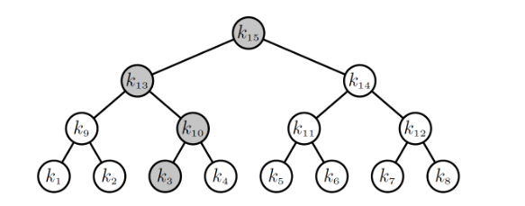
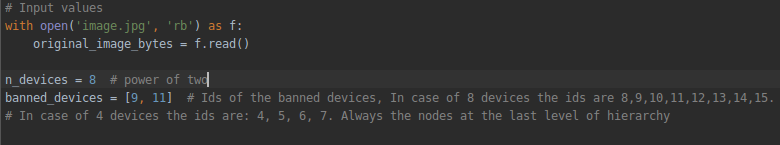

# Broadcast encryption with revocation
### Author: Inao Latourrette 
Given a total number of n devices (power of two). These n devices are the leaves of a complete binary 
tree. This tree is built so in each node is stored the correspondent key
from the root to each device (a leaf).
Also, the successors of each node contains the key of its parent node. In the case depicted in the following image the 
devices would be the nodes from k1 to k8. 



The code receives the following inputs: 
- The number of devices (to build the tree and generate the keys).
- The devices that are revoked.
- The image to encrypt.

The program uses AES-128 in CBC mode to encrypt. It generates one key k. It calculates the minimum
amount of keys within the tree that are needed to encrypt this key k so only the devices that are not
revoked can access to k. The key k is used to encrypt the given image. 
## Requirements 
- Clone this repository to your machine: 
``` git clone https://github.com/InaoLatu/broadcast-encryption-with-revocation.git ```
- Install python3 and pip3: 
```
   sudo apt update
   sudo apt install python3-pip
   sudo apt-get install python3 
```
-  Install virtualenv:
``` pip3 install virtualenv ```

-  Inside the folder, create the virtualenv: 
``` virtualenv venv```

- Activate virtualenv: ``` source venv/bin/activate```

- Install requirements: 
``` pip install -r requirements.txt ```

## How to use the code 
In *main.py* you have to set the input values as follows: 





